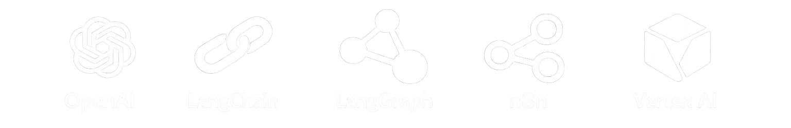

# 👋 Hi, I’m Vijay Singh

  

---

## 🚀 About Me

I’m a **Full-Stack Developer** who enjoys building scalable, secure, and high-performance web applications.  
I work across the frontend (React, Next.js), backend (Node.js, Core PHP), and cloud, focusing on clean architecture and real-world usability.

I’ve built and managed production systems, handled authentication, role-based access, analytics, and deployments, and I’m continuously learning modern technologies to stay ahead.

Currently exploring:
- **DevOps & Cloud Infrastructure**
- **Vector Databases & Embeddings**
- **Generative AI**

---

## 🛠️ My Tech Stack

### 🌐 Languages

---

### 🎨 Frontend
  
* **Other Frontend Skills:** SEO

---

### 🧠 Backend

---

### 💾 Databases
  
* **Other Databases:** Vector Databases

---

### ☁️ DevOps

---

### 🤖 AI & Automation

* **Other AI & Automation Skills:** RAG, Vector Embeddings

---

## 🤝 Let’s Connect

- GitHub: [github.com/theajthakur](https://github.com/theajthakur)
- LinkedIn: [linkedin.com/in/theajthakur](https://www.linkedin.com/in/theajthakur)
- Email: vijaysingh.handler@gmail.com

---

⭐ If you like clean architecture, scalable systems, and thoughtful code — you’ll feel at home here.
